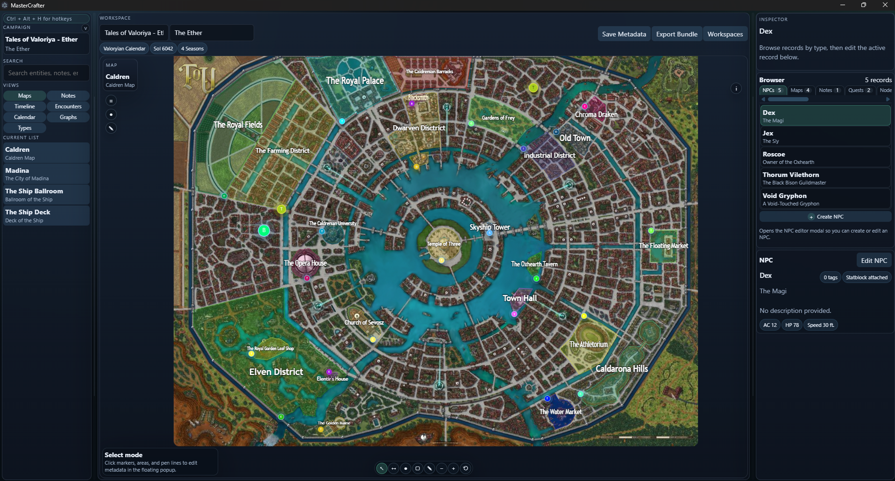
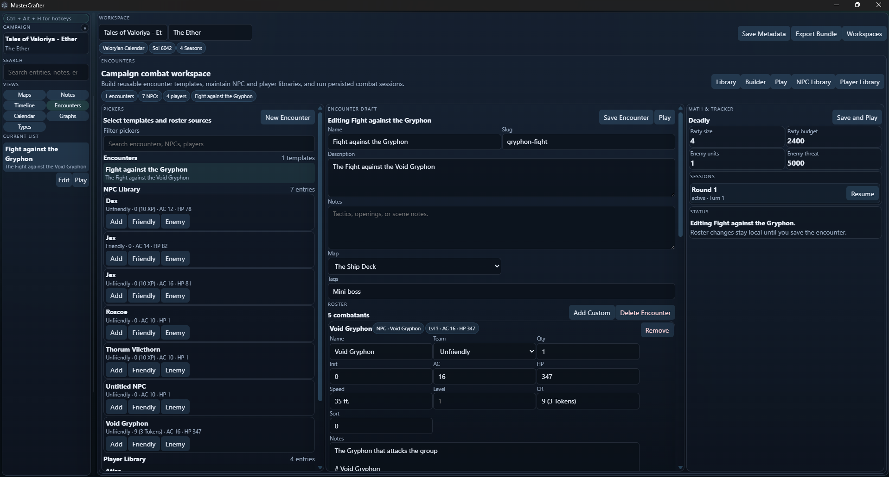
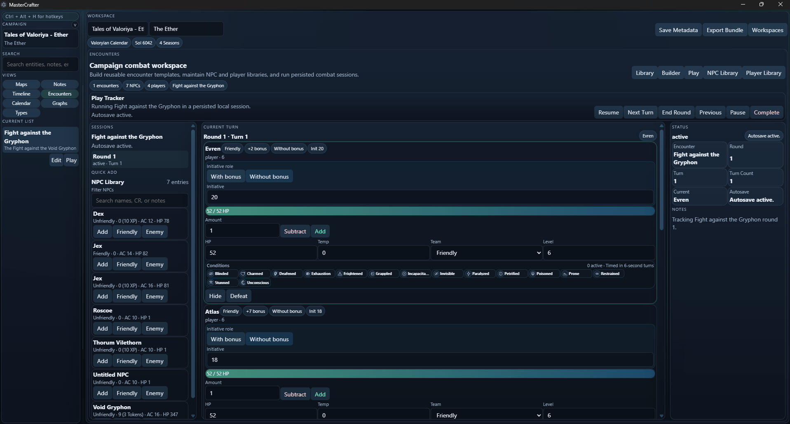
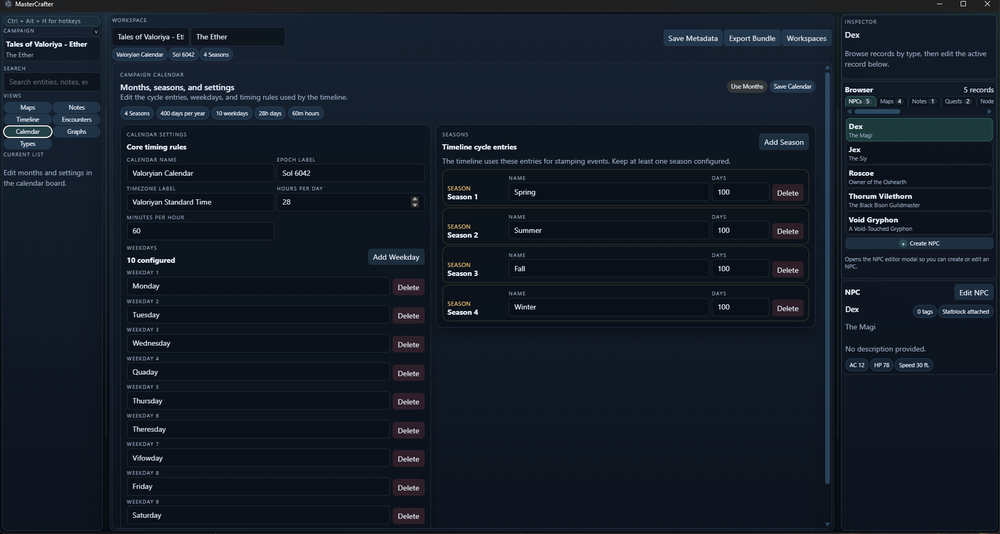
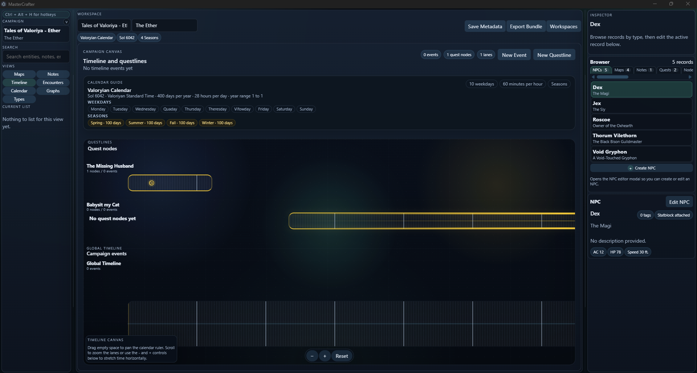

# MasterCrafter

MasterCrafter is a local-first desktop app for D&D campaign preparation. It keeps worldbuilding, maps, questlines, timelines, encounters, notes, and workspaces in one place so you can prep and run a campaign without bouncing between tools.

## Highlights

- Create, rename, open, delete, import, and export campaign workspaces.
- Model NPCs, landmarks, shrines, stores, items, notes, and custom entity types.
- Import map images and place point, region, and path markers linked to entities.
- Build calendar-aware timelines and questlines with linked events and quest nodes.
- Manage encounters with NPC and player libraries, combatants, sessions, and initiative tracking.
- Search across records and follow backlinks from the inspector.

## Screenshots

### Map editor

Import a map, browse available maps, and edit linked markers from the inspector.

### Encounters

We have a top of the line Encounter Builder and Player for you with round tracker, condition tracker and timers for static timers

#### Encounter Builder

#### Encounter Player

### Calendar Settings

Setup your own Weekdays and Months, setup how long a year is or dont you use Months but just seasons? You can! With Mastercrafter!

### Timeline Editor

This is the Timeline Editor, Do you have quests you have made and those are set in time or work with a fully dynamic timezone (your world keeps beating forward) then this is the tool you might wanna use aswell!

